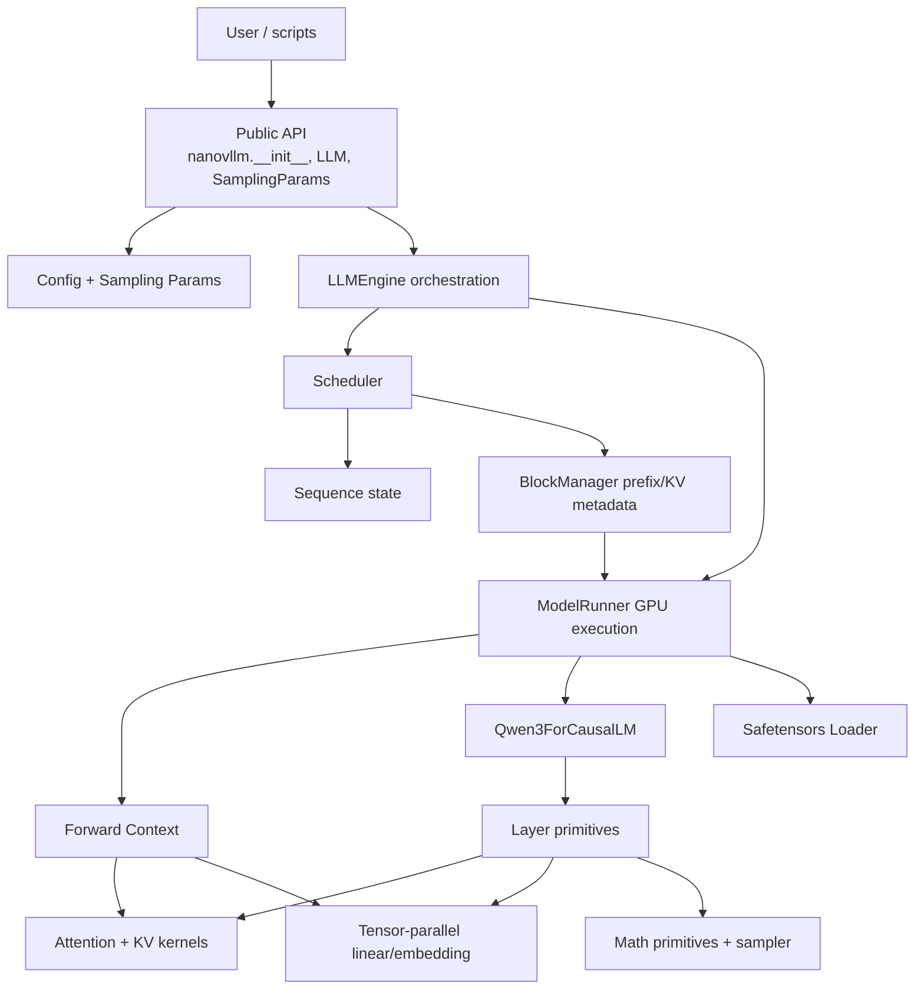
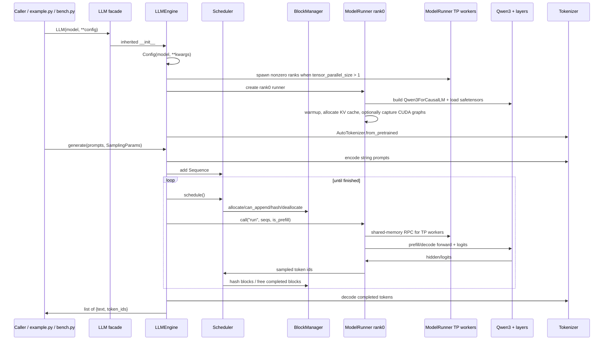

# Brownfield Architecture Atlas

**Generated:** 2026-05-12  
**Repository:** `/home/yanx/projects/vllm/nano-vllm`  
**Mode:** Verified + GSD bridge  
**Scope:** Whole repository  
**Source baseline:** commit `caa4415` after the prior `$gsd-map-codebase` commit.

This atlas is a handoff artifact. It explains logical architecture ownership before GSD mainline planning. It does **not** mutate `.planning/PROJECT.md`, `.planning/REQUIREMENTS.md`, `.planning/ROADMAP.md`, `.planning/STATE.md`, or phase directories.

## Top-Level Architecture Diagram



## Logical Module Tree

```text
nano-vllm logical architecture
├── public-api
│   ├── api-surface/package-facade
│   └── configuration/{config-normalization,sampling-parameters}
├── engine-runtime
│   ├── orchestration/request-lifecycle
│   ├── state/sequence-state
│   └── scheduling/{scheduler-policy,kv-block-manager}
├── gpu-execution
│   ├── process-control/distributed-process-control
│   ├── batching/batch-preparation-context
│   ├── cache-runtime/kv-cache-runtime
│   └── execution-mode/cuda-graph-execution
├── model-and-weights
│   ├── model-definition/qwen3-composition
│   └── weights/weight-loading
├── layer-primitives
│   ├── tensor-parallel/{tensor-parallel-linears,embedding-lm-head}
│   ├── attention/attention-kernels
│   ├── math/math-primitives
│   └── sampling/sampling-kernel
└── repository-ops
    ├── scripts/manual-scripts
    └── packaging/packaging-docs
```

## Runtime/Data-Flow Diagram



## Physical Directory to Logical Module Mapping

| Physical path | Logical owners | Notes |
| --- | --- | --- |
| `nanovllm/__init__.py`, `nanovllm/llm.py` | `public-api/api-surface/package-facade` | Thin import and subclass facade. |
| `nanovllm/config.py`, `nanovllm/sampling_params.py` | `public-api/configuration/*` | Engine-wide versus request-wide config split. |
| `nanovllm/engine/llm_engine.py` | `engine-runtime/orchestration/request-lifecycle` | Owns public generation lifecycle and runner/scheduler wiring. |
| `nanovllm/engine/sequence.py` | `engine-runtime/state/sequence-state` | Mutable request state shared across scheduler and runner. |
| `nanovllm/engine/scheduler.py`, `nanovllm/engine/block_manager.py` | `engine-runtime/scheduling/*` | Policy and CPU KV-block metadata. |
| `nanovllm/engine/model_runner.py` | `gpu-execution/*` | Dense multipurpose file split logically into process control, batch prep, cache allocation, graph execution. |
| `nanovllm/models/qwen3.py` | `model-and-weights/model-definition/qwen3-composition` | Only supported transformer model architecture. |
| `nanovllm/layers/linear.py`, `embed_head.py`, `attention.py`, `activation.py`, `layernorm.py`, `rotary_embedding.py`, `sampler.py` | `layer-primitives/*` | Tensor-parallel, kernel, math, and sampling primitives. |
| `nanovllm/utils/context.py`, `nanovllm/utils/loader.py` | `gpu-execution/batching`, `model-and-weights/weights` | Context is a runtime bridge; loader is a weights bridge. |
| `example.py`, `bench.py`, `pyproject.toml`, `README.md`, `LICENSE`, `assets/logo.png` | `repository-ops/*` | Manual workflows and packaging/docs. |

## Top-Level Responsibilities

### `public-api`
Boundary for users and future compatibility. Changes here affect imports, constructor semantics, and request option contracts. The current API is intentionally thin but import validation is blocked because dependencies are unavailable and `tqdm` is used without a package metadata dependency.

### `engine-runtime`
CPU-side orchestration and policy. This is where most feature planning should start for request lifecycle, scheduling, sequence state, and prefix-cache behavior. It can be made testable with CPU unit tests before GPU work.

### `gpu-execution`
CUDA/distributed execution. `ModelRunner` is a large logical boundary crossing process control, batch construction, KV-cache tensor ownership, sampling, and CUDA graph replay. Changes here have broad blast radius and need GPU-marked validation.

### `model-and-weights`
Supported model definition and model-weight loading. Currently Qwen3-only and tightly wired to tensor-parallel layers plus safetensors mapping. New model support should be planned as a major boundary change.

### `layer-primitives`
Reusable tensor, attention, distributed, and sampling primitives. These are high-risk because most modules require initialized torch/distributed/CUDA state and have no tests.

### `repository-ops`
Manual scripts, packaging metadata, README, and release hygiene. This domain currently lacks CI/test/lint contract and contains the clearest low-risk first GSD backlog candidate: packaging/import smoke.

## Validation Evidence Ledger

| Evidence source | Result |
| --- | --- |
| Codebase map | .planning/codebase/*.md consumed; 7 docs, 1195 total lines from the prior map pass. |
| GitNexus | npx gitnexus analyze refreshed index at commit caa4415; status up-to-date; 424 nodes, 734 edges, 17 clusters, 17 flows; embeddings preserved. |
| code-review-graph | code-review-graph update completed; status at commit caa4415; 158 nodes, 742 edges, 21 files; detect-changes reported 7 docs-only files, 0 changed functions/classes, risk 0.00. |
| graphify | graphify and gsd graphify query commands checked; unavailable: no graphify binary and gsd-sdk query graphify/graphify.status returned unknown command. |
| Compile check | python3 -m compileall -q nanovllm example.py bench.py passed. |
| Import/dependency check | Dependency probe failed for torch, triton, transformers, flash_attn, xxhash, numpy, safetensors, tqdm; package import smoke failed before runtime validation. |
| Source inventory | Source inventory counted 21 Python files; no open task markers; asserts present in config, engine, layers, model, and sampling modules. |

## Coverage Label Summary

| Label | Count | Meaning in this handoff |
| --- | ---: | --- |
| `verified` | 1 | Boundary, source, and lightweight check evidence passed for handoff readiness. |
| `deep-partial` | 2 | Source-grounded with validation ladder, but missing behavioral test evidence. |
| `exceptioned-deep-partial` | 17 | Source-grounded but verification was blocked or failed with explicit reason. |

## Planning Implications

1. Start with packaging/import/test harness before attempting GPU feature work; the current environment cannot import public API because dependencies are not installed and `tqdm` is absent from metadata.
2. Split `ModelRunner` work by logical leaf, not by file, because one file owns process control, tensor prep, KV cache, sampling, and CUDA graphs.
3. Scheduler and block-manager changes are the best candidates for first CPU-safe regression tests.
4. Qwen3/model/layer work should be planned with explicit dependency and GPU fixtures.
